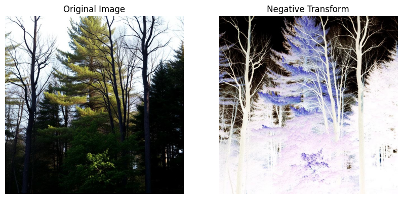
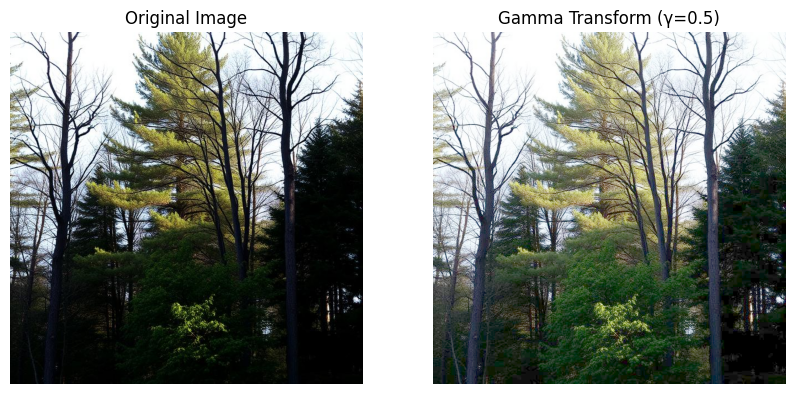
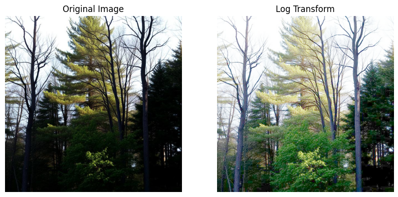
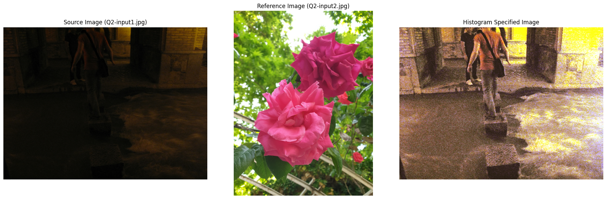
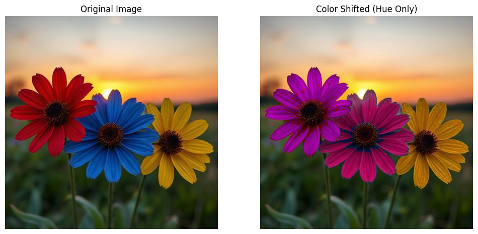
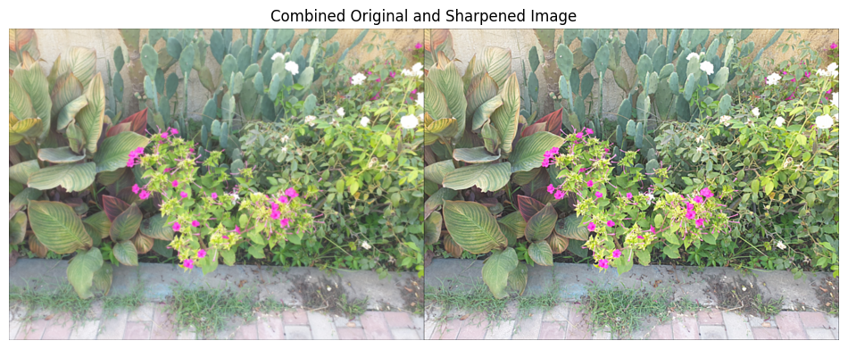
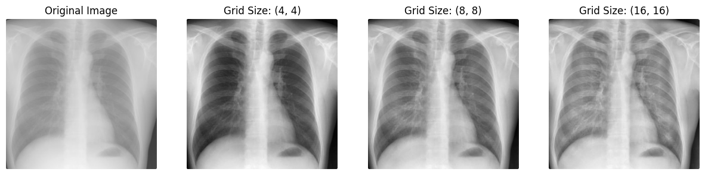
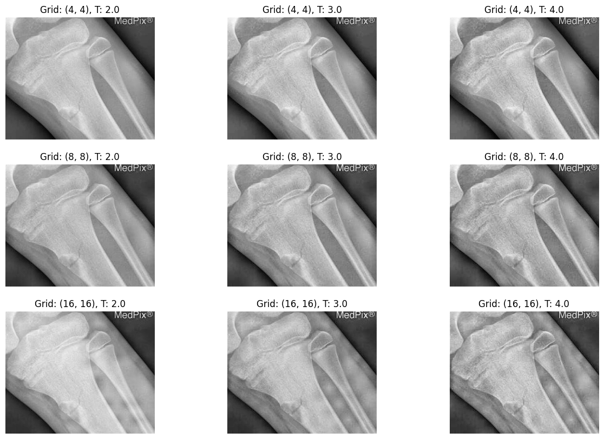

  This repository includes a series of image processing exercises implemented in **Python** using **OpenCV**, **NumPy**, and **Matplotlib**.  
Each question focuses on a fundamental concept of digital image processing — from enhancement and histogram operations to color manipulation, spatial filtering, and noise reduction.  

---

##  Q1 – Image Enhancement  

In this part, we explored **intensity transformation techniques** to enhance the visual quality of grayscale images.  
The goal was to observe how mathematical transformations can highlight specific intensity ranges and improve overall appearance.

###  1. Negative Transformation  
This method reverses the intensity levels of the image:
\[
s = L - 1 - r
\]
where *L* is the maximum gray level.  
It is especially useful for medical or scientific images where light areas need to appear dark and vice versa.  
By applying the negative transformation, bright regions became dark and subtle details in shadowed areas became more visible.

###  2. Logarithmic Transformation  
The log transformation enhances low-intensity pixels and compresses high-intensity values:
\[
s = c \times \log(1 + r)
\]
This technique is ideal when we need to **brighten dark regions** without overexposing bright areas.  
It effectively brings out small details in darker zones while keeping the overall tone balanced.

###  3. Gamma (Power-Law) Transformation  
The power-law or gamma correction is defined as:
\[
s = c \times r^{\gamma}
\]
This method allows **nonlinear control** over image brightness.  
- When **γ < 1**, the image becomes brighter.  
- When **γ > 1**, it becomes darker.  

**Result:**  

  
##  Q2 – Histogram Specification  

This section focused on **Histogram Specification** (also known as *Histogram Matching*), which aims to modify the tonal distribution of an image so that its histogram resembles that of a reference image.  
Unlike Histogram Equalization — which simply spreads pixel intensities uniformly — this method allows us to **achieve a specific visual style** by matching the brightness and contrast of another image.

###  Concept  
Every image has a histogram representing the frequency of intensity values.  
If two images have very different histograms, their visual appearance (contrast and tone) will differ significantly.  
The goal here is to **transform the pixel intensities of the input image** so that its histogram closely matches a *reference histogram*.

The process follows these steps:

1. Compute the **Probability Density Function (PDF)** and **Cumulative Distribution Function (CDF)** for both the input and the reference images.  
2. For each intensity value in the input image, find the corresponding intensity in the reference image with the closest CDF value.  
3. Map each pixel based on this correspondence, generating the output image whose histogram resembles the reference.

### Formula  
If \( r \) and \( z \) denote the input and output intensity values, and \( T(r) \), \( G(z) \) are their respective CDFs, then:
\[
s = G^{-1}(T(r))
\]
This ensures that the cumulative intensity distribution of the output image matches that of the reference.

###  Observations  
- Histogram matching can **adjust overall brightness and contrast** while preserving local details.  
- Works best when input and reference images have **similar content** (e.g., both natural scenes).  
- It can be used to achieve *color consistency* across image datasets or to apply the “look” of one image to another.

**Result:**  

---

##  Q3 – Color Processing  

In this exercise, we focused on **color manipulation** using the **HSV color space**.  
The task was to detect flowers of specific colors (red, blue, yellow) and change their hues to new target colors (violet, pink, orange).  
  

**Result:**  

---

##  Q4 – Spatial Filters (Blurring)  

The purpose of this part was to understand the **effect of spatial filters** on image smoothing.  
We implemented and compared three main filters:  

- **Box Filter:** A simple averaging filter; each pixel becomes the mean of its neighborhood.  
- **Gaussian Filter:** Weighted average where closer pixels have higher importance; gives smoother blur.  
- **Median Filter:** Replaces each pixel with the median of its neighborhood; excellent for removing salt-and-pepper noise.  

---

##  Q5 – Sharpening  

Here we implemented **unsharp masking**, a technique that enhances image edges by subtracting a blurred version of the image from the original.  

Steps followed:  
1. Apply a **Gaussian blur** with a chosen σ (standard deviation).  
2. Compute the **mask** as `m = f - (f * g)` where g is the Gaussian kernel.  
3. Add a scaled version of the mask to the original: `f' = f + αm`.  

Parameters:  
- **σ (sigma):** Controls the blur intensity.  
- **α (alpha):** Controls the strength of sharpening.  

**Result:**  

---

##  Q6 – Noise Removal  

The final section focused on **adding and removing noise** using several advanced techniques.  

###  A) Adaptive Contrast Enhancement (ACE)  
ACE enhances contrast locally by analyzing small blocks of the image.  
By adjusting grid sizes, we observed that:  
- Small grids → stronger local enhancement, sometimes noisy.  
- Large grids → smoother global contrast improvement.  
The best results came from moderate grid sizes that balanced both.  

**Result:**  

---

###  B) CLAHE (Contrast Limited Adaptive Histogram Equalization)  
CLAHE improves local contrast while avoiding over-amplification of noise by clipping the histogram.  
We experimented with grid sizes `(4×4, 8×8, 16×16)` and thresholds `(2.0, 3.0, 4.0)`.  

**Observations:**  
- Smaller grids improved details but risked over-enhancement.  
- Clip limit ≈ 3.0 gave balanced results without artifacts.  

**Result:**  

---

###  C) Noise Addition (Gaussian and Salt-and-Pepper)  
We artificially added two types of noise to test denoising algorithms:  
- **Gaussian noise:** Follows normal distribution, affects all pixels.  
- **Salt-and-pepper noise:** Random white and black pixels scattered on the image.  

These models simulate common noise types in real-world sensors.  

---

###  D) Denoising Methods  
We implemented and compared three noise-removal filters:  
- **Morphological Filters:** Used for structure-based cleaning.  
- **Median Filter:** Excellent for salt-and-pepper noise.  
- **Adaptive Median Filter:** Adjusts window size dynamically for stronger noise.  

---

> *This repository serves as a practical guide for understanding and experimenting with fundamental image processing techniques in Python.*  
